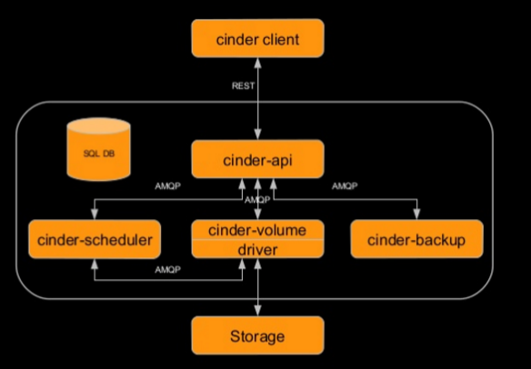

# Cinder

Cinder là dịch vụ block storage trong OPS. Nó được thiết kế để người dùng có thể thực hiện việc lưu trữ bởi nova. Có thể sử dụng cinder block storage bằng LVM hoặc các plugin driver cho các nền tảng lưu trữ khác.

Cinder ảo hóa việc quản lý các thiết bị block storage và cung cấp cho người dùng một API đáp ứng được như cầu tự phục vụ cũng như tiêu thị các tài nguyên đó mà không cần biết quá nhiều kiến thức chuyên sâu.

### Một số khái niệm

- **Share storage**: Là hệ thống lưu trữ được sử dụng chung bởi nhiều người hay máy tính. Nó lưu trữ tất cả các tệp trong một kho lưu trữ tập trung và cho phép nhiều người dùng truy cập chúng cùng 1 lúc.

- **Scale up**: Nâng cấp những thứ hiện có để có hiệu năng tốt hơn và xử lý nhiều tải hơn. Ví dụ: thay thế CPU 2 core thành CPU 4 core

- **Scale out**: Thêm nhiều thành phần tương tự hiện có để chia tải, đồng thời phải sử dụng các giải pháp cân bằng tải 

- **File storage**: Lưu trữ cấp độ tệp hoặc lưu trữ dựa trên tệp, là một phương pháp lưu trữ phân cấp được sử dụng để tổ chức và lưu trữ dữ liệu trên ổ cứng máy tính hoặc trên NAS. Thường được sử dụng cho dữ liệu có cấu trúc và dung lượng không quá lớn.

- **Block sotrage**: Lưu trữ dựa trên các khối. Là một công nghệ được sử dụng để lưu trữ các file dữ liệu trên SANs hoặc cloud. Block storage chia dữ liệu thành các block và sau đó lưu trữ các block dưới dạng các phần riêng biệt, mỗi block có mã định danh duy nhất. Điều đó có nghĩa là nó có thể lưu trữ các block đó trên các hệ thống khác nhau và mỗi khối có thể được cấu hình để  hoạt động với các hệ điều hành khác nhau. Nó tách dữ liệu khỏi môi trường người dùng, cho phép dữ liệu đó được trải rộng trên nhiều môi trường. Điều này tạo ra nhiều đường dẫn đến dữ liệu và cho phép người dùng truy xuất dữ liệu nhanh chóng

- **Object storage**: lưu trữ dựa trên đối tượng. Thường được sử dụng để xử lý khối lượng lớn dữ liệu phi cấu trúc. Đây là dữ liệu không phù hợp hoặc không thể được tổ chức dễ dàng vào cơ sở dữ liệu quan hệ truyền thống với các hàng và cột. Dữ liệu phi cấu trúc bao gồm: email, hình ảnh, video, ... Object storage không sử dụng thư mục hay hệ thống phân cấp phức tạp nào. Thay vào đó, mỗi object là một kho lưu trữ độc lập gồm dữ liệu, metadata, và ID xác thực để ứng dụng dùng để truy cập. Nó dùng để lưu trữ dữ liệu không thay đổi thường xuyên hoặc hoàn toàn (tệp tĩnh), chẳng hạn như hồ sơ giao dịch hoặc tệp nhạc, hình ảnh và video.

### Architecture

- **cinder-api**: xác thực và định tuyến các yêu cầu xuyên suốt dịch vụ Cinder

- **cinder-scheduler**: Lên lịch và định tuyến các yêu cầu tới dịch vụ volume thích hợp. Tùy thuộc vào cách cấu hình, có thể chỉ là dùng round-robin để định ra việc sẽ dùng volume service nào, hoặc phức tạp hơn có thể sử dụng Filter Scheduler. Filter Scheduler là mặc định và bật các bộ lọc như Capacity(sức chứa), Avaibility Zone, Volume Type, và Capability(khả năng).

- **cinder-volume**: Quản lý thiết bị block storage, đặc biệt là các thiết bị back-end

- **cinder-backup**: Cung cấp phương thức để backup một Block Storage volume tới Openstack Object Storage (Swift)

- **Driver**: Chứa các mã back-end cụ thể để có thể liên lạc với các loại lưu trữ khác nhau.

- **Storage**: Các thiết bị lưu trữ từ các nhà cung cấp khác nhau.

- **SQL DB**: Cung cấp một phương tiện dùng để back up dữ liệu từ Swift/Celp, etc,....

