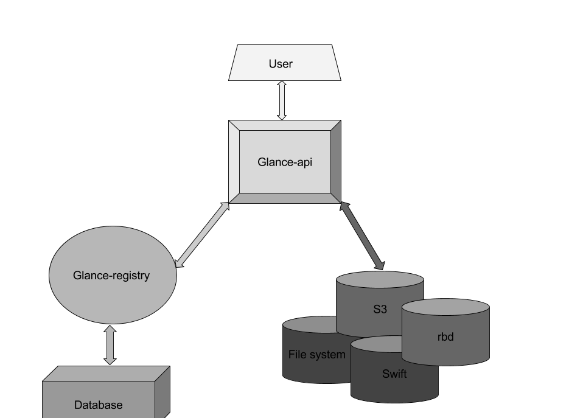
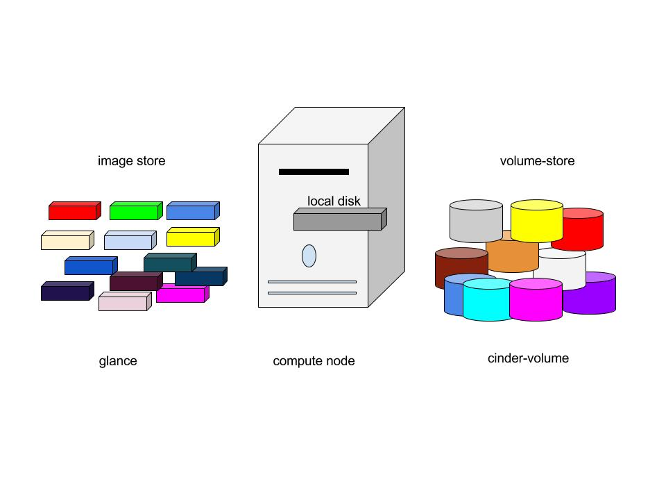

# Glance

Glance là một dịch vụ image mà cung cấp các chức năng: discovering, registering, retrieving for disk and server images

Openstack glance là một trung tâm lưu trữ các virtual image

Glance có RESTfull API chho phép truy vấn vào VM image cũng như khôi phục lại các image hiện tại

Trong glance, các image được lưu trữ như các mẫu mà có thể được sử dụng để tạo máy ảo mới. 

Glance được thiết kế để trở thành 1 dịch vụ độc lập cho những người cần tổ chức các bộ virtual disk image trên cloud

Nó cũng có thể snapshots từ các máy ảo đang chạy để lưu trạng thái của VM

## 1. Glance Components

Glance có các thành  phần sau:

- Glance-api: chấp nhận các lời gọi đến API để phát hiện, truy xuất và lưu trữ image
- Glance-registry: lưu trữ, xử lý và lấy thông tin cho image
- Database: là nơi lưu trữ metadata của image
- Storage repository: Tích hợp các thành phần bên ngoài OpenStack khác nhau như hệ thống tập tin thông thường, Amazone S3 và HTTP để lưu trữ image

Glance chấp nhận các yêu cầu API cho image từ end-users hoặc các thành phần của Nova và có thể lưu trữ các tệp của nó trong dịch vụ object storage

Glance hỗ trợ backend để lưu trữ image như sau:

- File system: các image được lưu trữ trong hệ thống file, đây là back end mặc định. Nó đơn giản chỉ là viết file image vào thư mục nào đó
- Object Storage:  Dịch vụ Openstack có sẵn để lưu trữ các Object
- Block Storage: Dịch vụ OpenStack có sẵn để lưu trữ các Block
- GridFS: Lưu trữ image sử dụng mongoDB

## 2. Glance Architecture

- Glance có cấu trúc theo mô hình client-server và cung cấp RESTfull API mà thông qua đó các yêu cầu được gửi đến server để thực hiện. Yêu cầu từ các client được chấp nhận thông qua RESTfull API và chờ keystone xác thực

- Glance Domain controller thực hiện quản lý tất cả các hoạt động bên trong. Các hoạt động được chia ra thành các tầng khác nhau. Mỗi tầng thực hiện 1 chức năng riêng biệt

- Glance store là lớp giao tiếp giữa glance và storage backend ở ngoài glance hoặc local filesystem và nó cung cấp giao diện thống nhất để truy cập. Glance sử dụng SQL central Database để truy cập cho tất cả các thành phần trong hệ thống

- Glance bao gồm một vài thành phần sau:

    - Client: Bất kỳ ứng dụng nào sử dụng Glance đều được gọi là client
    - REST API: Dùng để gọi đến các chức năng cuar glance thông qua REST
    - Database Abstraction Layer (DAL): Một API để thống nhất giao tiếp giữa Glance và database
    - Glance Domain Controller: là middleware thực hiện các chức năng chính của Glance là: authorization notifications, policies, database connections.
    - Glance Store: Tổ chức các tác động giữa Glance và lưu trữ dữ liệu khác
    - Registry Layer: Tùy chọn tổ chức một lớp trao đổi thông tin an toàn giữa các miền và các DAL bằng cách sử dụng một dịch vụ riêng biệt.

## 3. Glance Formats

- Khi upload một image lên glance, chúng ta phải chỉ rõ định dạng của virtual machine images

- Glance hỗ trợ nhiều kiểu định dạng như disk format và contianer format

- Virtual disk tương tự như server's boot driver vật lý, chỉ tập trung vào trong 1 tệp tin. Điều khác là virtualation hỗ trợ nhiều định dạng disk khác nhau.

Các định dạng disk được hỗ trợ bởi OPS Glance

## 4. Image and Instance 

Instance là những máy ảo độc lập chạy trên các compute node, compute node quản lý các instance. Người dùng có thể khởi động với số lượng bất kỳ các máy ảo cùng 1 image. Mỗi lần chạy 1 máy ảo thì được thực hiện bằng cách sao chép từ base image, bất kỳ sửa đổi nào trên instance không ảnh hưởng đến các base image.

Khi chạy 1 instance, ta cần xác định các flavor. Đó là đại diện cho tài nguyên ảo. Flavor xác định bao nhiêu CPU cho một instance cần có và số lượng RAM sẵn có cho nó và kich thước của nó trong bộ nhớ tạm của mình. Openstack cung cấp một thiết lập flavor được xác định từ trước, ta có thể chỉnh sửa các flavor riêng của chúng ta. Sơ đồ dưới đây cho biết tình trạng của hệ thống trước khi lauching an instance. Cacs image store có số lượng image được xác định trước, compute node chứa CPU có sẵn, bộ nhớ và tài nguyên local disk và cinder-volume chứa số lượng đã được xác định từ trước. 

Trước khi chạy 1 instance chọn 1 image, flavor và bất kỳ thuộc tính tùy chọn nào. Chọn flavor cung cấp một root volume, nhãn (label) là "vda" và một bổ sung vào bộ nhớ tạm thời dán nhãn là "vdb" và cinder-volume được ánh xạ tới ổ đĩa thứ 3 gọi là "vdc".

- `VDA`: Các image được sao chép vào các local disk. VDA là disk đầu tiên mà các instance được truy cập. 
- `VDB`: là một disk tạm có các sản phẩm tạo ra cùng với instance sẽ bị xóa khi kết thúc instance
- `VDC`: kết nối với cinder-volume sử dụng iSCCI. Sau khi compute node quy định vCPU và tài nguyên bộ nhớ. Các instance boots up từ root volume VDA. Instance chạy và thay đổi dữ liệu trên disk. Nếu volume store nằm trên một mạng riêng biệt, tùy chọn my_block_storage_ip trong tập tin cấu hình storage node sẽ chỉ đạo giao tiếp với compute node.

