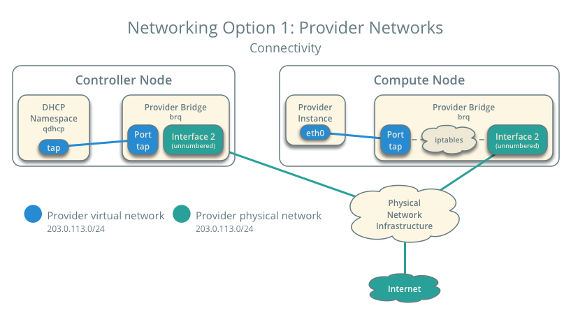

# Neutron 

Openstack network cho phép bạn tạo và quản lý các network objects ví dụ như networks, subnets và ports cho các service khác của OpenStack sử dụng. Với kiến trúc plugable, các plug-in có thể được sử dụng để triển khai các thiết bị và phần mềm khác nhau, nó khiến OpenStack có tính linh hoạt trong kiến trúc và triển khai. 

Dịch vụ networking trong OpenStack cũng cung cấp API cho phép định nghiwax các kết nối mạng và gán địa chỉ ở trong môi trường cloud. Nó cũng cho phép các nhà khai thác vận hành các công nghệ networking khác nhau cho phù hợp với mô hình điện toán đám mây của riêng họ. Neutron cũng cung cấp một API cho việc cấu hình cũng như quản lý các dịch vụ networking khác nhau từ L3 forwarding, NAT cho tới loadbalancing, perimeter firewalls, và virtual private networks.

OPS là mô hình multitenancy. Tức mỗi tenant có thể tạo riêng nhiều private network, router, firewall, loadbalancer ... Neutron có khả năng tách biệt các tài nguyên mạng giữa các tenant bằng giải pháp linux namespace. Mỗi network namespace riêng cho phép tạo các route, firewall rule, interface device riêng. Mỗi network hay router do tenant tạo ra đều hiện hữu dưới dạng 1 network namespace, từ đó các tenant có thể tạo các network trùng nhau nhưng vẫn độc lập mà không bị xung đột

## Các thành phần Neutron

**API server:**

- Neutron API hỗ trợ Layer2 networking
- IPAM (quản lý địa chỉ IP)
- Extension để xây dựng router Layer 3 cho phép định tuyến giữa các networks layer 2 và các gateway để ra mạng bên ngoài.

Openstack networking cung cấp 1 danh sách các plug-in cho phép tương tác với nhiều công nghệ mạng mã nguồn mở và cả tương mại, bao gồm các routers, switches, switch ảo và SDN controller.

**Openstack networking plugin and agents**

Các plugin và các agent cho phép gắn và gỡ các port, tạo ra network hay subnet và đánh địa chỉ IP. Lựa chọn plugin và agents nào là tùy thuộc vào nhà cung cấp và công nghệ sử dụng trong hệ thống cloud nhất định. Điều quan trọng là tại 1 thời điểm chỉ sử dụng được 1 plug-in

Các Neutron plugin:

- Là giao diện kết nối giữa neutron và các công nghệ back-end như SDN, Cisco, VMware NSX. Nhờ đó, người dùng neutron có thể tận dụng các tính năng nâng cao của các thiết bị mạng hoặc phần mềm mạng của bên thứ 3. Các plugin bao gồm Open vswitch, Linux bridge, ...

- Một trong các plugin không trực tiếp liên quan tới công nghệ bên thứ 3 nhưng là 1 plugin quan trọng đó là ML2 plugin. Plugin này cho phép hoạt động đồng thời của nhiều công nghệ mạng hỗn hợp trong Neutron.

## Một số khái niệm

Với neutron, bạn có thể tạo và cấu hình các network, subnet và thông báo tới compute để gán thiết bị ảo vào các ports của mạng vừa tạo. Openstack compute chính là `client` của neutron, chúng liên kết với nhau để cung cấp kết nối mạng cho các máy ảo. CỤ thể hơn, OPS networking hỗ trợ cho phép các project có nhiều private networks và các projects có thể tự chọn danh sách IP cho riêng mình, kể cả những IP đã được sử dụng bởi một project khác

Có 2 loại network

- Provider
- Self-service networks

### 2.1. Provider networks

Provider networks cung cấp kết nối layer 2 cho các máy ảo với các tùy chọn hỗ trợ cho dịch vụ DHCP và metadata. 

Bên cạnh đó, các provider network chỉ quản lý kết nối ở layer 2 cho máy ảo, vì thế nó thiếu đi một số tính năng ví dụ như định tuyến và gán floating IP

Các nhà khai thác đã quen thuộc với kiến trúc mạng ảo dự trên nền tảng mạng vật lý cho layer2, layer3 và các dịch vụ khác có thể dễ dàng triển khai Openstack Networking service

Vì các thành phần chịu trách nhiệm cho việc vận hành kết nối layer3 sẽ ảnh hưởng đến hiệu năng và tính tin cậy nên provider networks chuyển các kết nối này xuống tầng vật lý. Tức nếu có kết nối mạng có vấn đề thì provider network cũng bị ảnh hưởng

### 2.2. Routed provider networks

Routed provider cung cấp kết nối layer cho các máy ảo. Các network này map với những networks layer 3 đã tồn tại. Cụ thể hơn, các layer 2 segments của provider network sẽ được gán các router gateway giúp chúng có thể được định tuyến ra bên ngoài chứ thực chất networking service không cung cấp khả năng định tuyến. Routed provider networks tất nhiên sẽ có hiệu suất thấp hơn so với provider networks.

### 2.3. Self-service networks

Self-service networks được ưu tiên ở các projects thông thường để quản lý networks mà không cần quản trị viên. Các networks này là ảo và có yêu cầu các routers ảo để giao tiếp với provider và external networks. Self-service networks cũng đồng thời cung cấp dịch vụ DHCP và metadata cho máy ảo.

Trong hầu hết các trường hợp, self-service networks sử dụng các giao thức VXLAN hoặc GRE bởi chúng hỗ trợ nhiều hơn là  VLAN tagging. Bên cạnh đó, Vlans cũng thường yêu cầu phải thêm cấu hình ở tầng vật lý.

Với IPv4, self-service networks thường sử dụng dải mạng riêng và tương tác với provider networks thông qua 
cơ chế NAT trên router ảo. Floating IP sẽ cho phép kết nối tới máy ảo thông qua địa chỉ NAT trên router ảo. Trong khi đó, IPv6 self-service networks thì lại sử dụng dải IP Public và tương tác với provider networks bằng giao thức định tuyến tĩnh qua router ảo.

Trái ngược với provider network, self-service networks buộc phải đi qua layer3-agent. Vì thế việc gặp sự cố ở một node có thể ảnh hưởng tới rất nhiều các máy ảo sử dụng chúng. 

Các user có thể tạo các project networks cho các kết nối bên trong project. Mặc định thì các kết nối này là riêng biệt và không được chia sẻ giữa các project. OPS networking hỗ trợ các công nghệ dưới đây cho project network

**FLAT**

Tất cả các instance nằm trong cùng 1 mạng và có thể chia sẻ với hosts. Không hề sử dụng VLAN tagging hay hình thức tách biệt về network khác.

**VLAN**

Kiểu này cho phép các users tạo nhiều provider hoặc project network sử dụng VLAN IDs tương ứng với VLANs trong mạng vật lý. Điều này cho phép các instances giao tiếp với nhau trong môi trường cloud. Chúng có thể giao tiếp với servers, firewalls, loadbalancers và các hạ tầng network khác trên cùng 1 VLAN layer 2

**GRE và VXLAN**
VXLAN và GRE là các giao thức tạo nên overlay networks để kích hoạt, kiểm soát việc truyền thông giữa các máy ảo (instances). Một router được yêu cầu để cho phép lưu lượng đi ra luồng bên ngoài tenant network với mạng bên ngoài. Router cung cấp khả năng kết nối tới instance trực tiếp từ mạng bên ngoài sử dụng các địa chỉ floating IP

