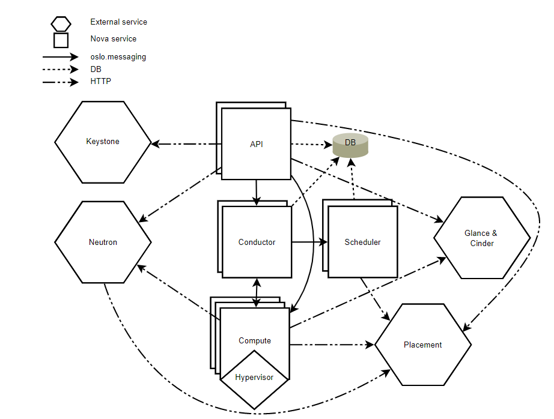

# Nova

Nova là service chịu trách nhiệm chứa và quản lý các hệ thống cloud computing. Openstack nova là 1 project core trong Openstack , nhằm mục đích cấp phép các tài nguyên và quản lý số lượng lớn máy ảo.

Openstack compute chính là phần chính quan trọng nhất trong kiến trúc hệ thống Infastructure-as-a-Service (IaaS). Phần lớn các modules của nova được viết bằng Python

OpenStack Compute giao tiếp với các service khác của OPS:
- Keystone 
- Glance
- Horizon

Nova cho phép bạn điều khiển các máy ảo và networks, bạn cũng có thể quản lý các truy cập tới cloud từ users và projects. Openstack Compute không chứa các phần mềm ảo hóa. Thay vào đó, nó sẽ định nghĩa các drivers để tương tác với các kỹ thuật ảo hóa khác chạy trên hệ điều hành của bạn và cung cấp các chức năng thông qua một web-based API.

## 1. Các thành phần của Nova

- `nova-api`: là service tiếp nhận phản hồi các compute API calls từ user. Service hỗ trợ OpenStack Compute API, Amazone EC2 API và Admin API đặc biệt được dùng để user thực hiện các thao tác tác quản trị. Nó cũng có 1 loạt các policies và thực hiện hầu hết các orchestration activities ví dụ như chạy máy ảo.

- `nova-api-metadata`: Là service tiếp nhận các metadata request từ máy ảo. Service này thường được dùng khi chạy multi-host kết hợp với nova-network.

- `nova-compute`: Là service chịu trách nhiệm tạo và hủy các máy ảo qua hypervisors APIs. Ví dụ: XenAPI for XenServer/XCP, libvirt for KVM or QEMU, VMwareAPI for VMware quá trình xử lý khá phức tạp, về cơ bản, daemon tiếp nhận các actions từ queue và thực hiện một loạt các câu lệnh hệ thống như chạy máy ảo kvm và upsate trạng thái trong database.

- `nova-placemont-api`: Lần đầu xuất hiện tại bản newton, placement api được dùng để theo dõi thống kê và mức độ sử dụng của mỗi resource provider. Provider ở đây có thể là compute node, shared storage pool hoặc ip allocation pool. Ví dụ, một máy ảo có thể được khởi tạo và lấy RAM, CPU từ compute node, lấy disk từ storage bên ngoài và lấy địa chỉ ip từ pool resource bên ngoài.

- `nova-scheduler`: Service này sẽ lấy các yêu cầu máy ảo đặt vào queue và xác định xem chúng được chạy trên compute server host nào.

- `nova-conductor`: Là module chịu trách nhiệm về các tương tác giữa nova-compute database. Nó sẽ loại bỏ tất cả các kết nối trực tiếp từ nova-compute tới database

- `nova-consoleauth`: Xác thực token cho user mà console proxies cung cấp. Dịch vụ này buộc phải chạy cùng console proxies. Bạn có thể chạy proxies trên 1 nova-consoleauth service hoặc ở trong 1 cluster configuration.

- `nova-spicehtml5proxy`: Cung cấp proxy để truy cập các máy ảo đang chạy thoog qua SPICE connection. Nó hỗ trợ các trình duyệt based HTML5 client.

- `nova-xvpvncproxy`: Cung cấp proxy để truy cập các máy ảo đang chạy thông qua VNC connection. Nó hỗ trợ OpenStack-specific java client.

- `the queue`: Trung tâm giao tiếp giữa các daemons. Thường dùng RabbitMQ hoặc các AMQP message queu khác như ZeroMQ.

- `SQL database`: Dùng để lưu các trạng thái của hạ tầng cloud bao gồm:

    - Các loại máy ảo có thể chạy
    - Các máy ảo đang được dùng
    - Các network khả dụng
    - Project

    Theo lý thuyết, Nova hỗ trợ tất cả các database mà SQLALchemy support ví dụ như SQLLite3, MySQL, MariaDB và ProgreSQL.

## 2. Kiến trúc của nova 

- `DB`: sql database để lưu trữ dữ liệu.
- `API`: Thành phần để nhận HTTP request , chuyển đổi các lệnh và giao tiếp với thành các thành phần khác thông qua oslo.messaging queuses hoặc HTTP.
- `Scheduler`: Quyết định ,máy chủ được chọn để chạy máy ảo.
- `Compute`: Quản lý giao tiếp với hypervisor và vitual machines.
- `Conductor`: Xử lý các yêu cầu mà cần sự phối hợp (build/resize), hoạt động như một proxy cho cơ sở dữ liệu, hoặc đối tượng chuyển đổi.
- `Placement`: theo dõi tài nguyên còn lại và đã sử dụng